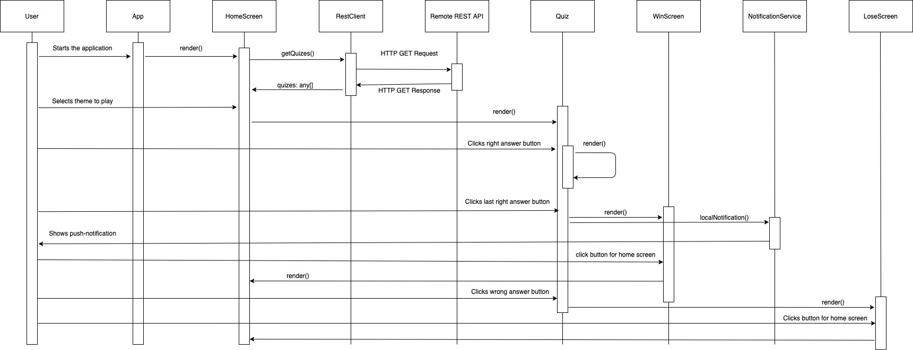
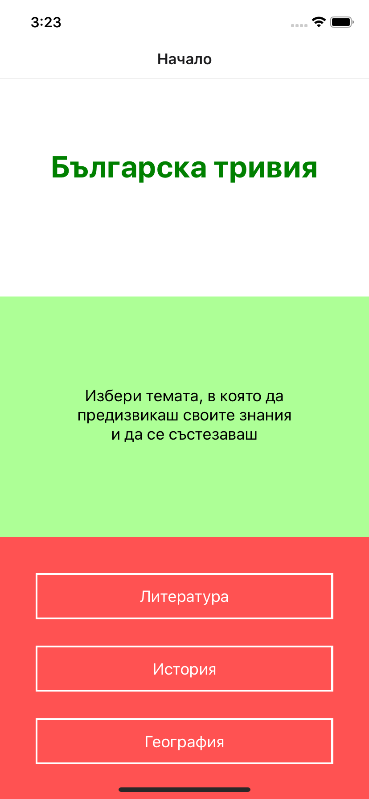
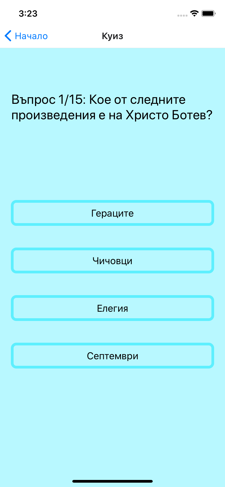
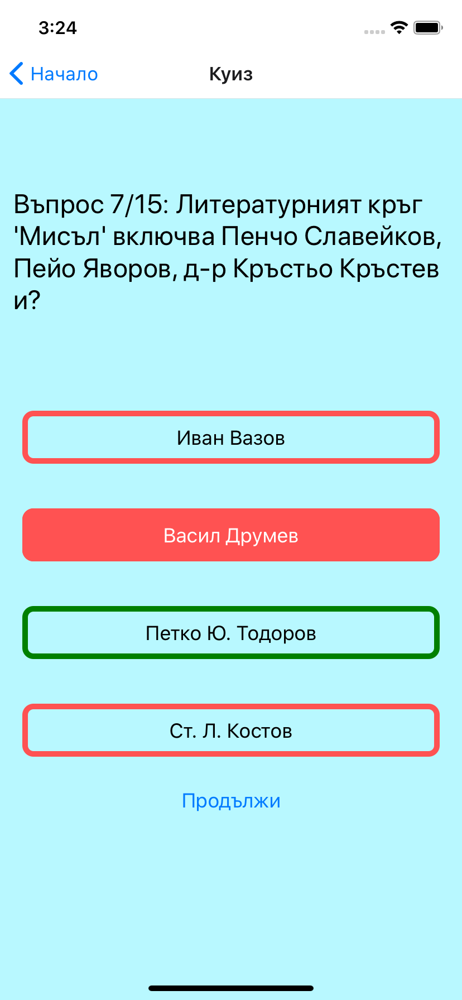
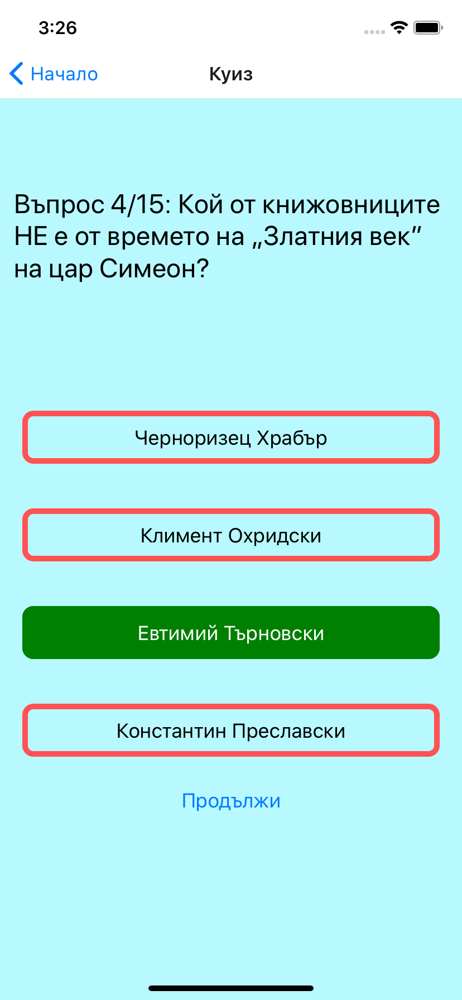
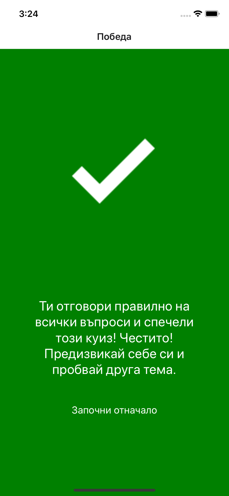
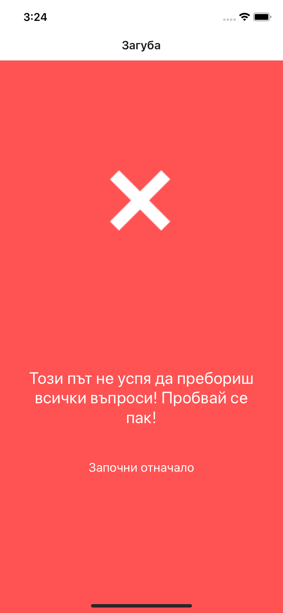

 **Технически университет
–** **София**

Факултет по компютърни системи и технологии

Курсова работа

по

Програмиране за мобилни устройства

Изготвил: Радослав Александров Димитров         Ръководител: Невен
Николов

Фак. н. 121217081

ФКСТ, КСИ, група 36

31.05.2020

Съдържание

1.  Увод.………………………………………………………………………………………………………….………………… 3

2.  Анализ на съществуващи разработки.…………………………………………………….………………… 4

3.  Проектиране………………………………………………………………………………………………..……………… 5

4.  Диаграма на последователностите (Sequence
    diagram)…………………………………….…….. 6

5.  Софтуерна реализация……………………………………………………………………………….……………… 7

6.  Потребителско ръководство……………………………………………………………………..………………. 9

7.  Заключение………………………………………………………………………………………………….……………. 13

8.  Сорс код ……………………………………………………………………………………………………………………. 14

> Увод

Целта на курсовата задача е да се реализира хибридно мобилно приложение.
Идеята на приложението е да се популяризира българското културно
наследство под формата на игра. Играта ще представлява
интерактивен тест, в който потребителите ще могат да премерят
своите знания в различни научни и културни сфери като „Литература“,
„История“ и „География“ на България. Дизайнът и потребителският
интерфейс трябва да е удобен за хора от всякаква възраст като
основната целева група са деца между 7 и 15 години. Приложението
трябва да наподобява известни игри като „Стани богат“ и „Тривиадор“, но
идеята е, съдържанието на играта да бъде насочено към българската
култура. По този начин потребителите ще имат възможност да
опознаят още по-добре история, литература и география на
България.

Анализ на съществуващите разработки

Съществуват голям брой аналогични разработки, като повечето от тях няма
конкретна тематика на съдържанието, тествайки общата култура на играча.
Съществуват разработки, за почти всички възрастови групи, като масово се
таргетират хора с по-високо от средното ниво на обща култура.

Най-популярни съществуващи разработки са:

1.  “Who wants to be a millionaire?” – или по-позната като „Стани богат“
    в България, съществува като игра за мобилни устройства. Играта
    представлява последователност от въпроси, на които
    потребителят се опитва да отговори за да спечели.
    Таргетирани са потребители с по-висока обща култура, като
    това я прави по-сложна за деца на възраст между 7 и 15 години.
    Играта предоставя съдържание във всякакви области и няма
    възможност за избиране на въпроси с българска културна
    тематика.

2.  “Trivia Crack” е популярна игра, която тества общата култура на
    играча. Главната идея е, че потребителите се състезават с други
    играчи, като има възможност за избиране на тематика на въпросите –
    история, спорт, наука, изкуство, забавление и география. В нея са
    таргетирани деца във всякаква възраст.

3.  “Great Bulgaria Quiz” е подобна игра, в която потребителят тества
    своите знания в сферата на българската история. Подходяща е за
    деца и възрастни. Недостатък е, че не се покриват и други аспекти
    от българската култура като литературата и географията.

> Проектиране

Приложението предлага навигация между няколко екрана:

  - Начален екран, където потребителят има възможност да избере тематика
    на въпросите в играта. Различните теми са представени като бутони ,
    които потребителят може да избере и да стартира. Всички останали
    екрани могат да навигират обратно към този екран.

  - Екран, изобразяващ въпросите и техните възможни отговори. Отговорите
    са представени като бутони, които потребителят може да натисне за да
    отговори. След избиране на конкретен отговор, грешните отговори се
    очертават в червен цвят, а верният отговор – в зелен. Избраният
    отговор бива запълнен в съответният цвят и потребителят разбира
    дали е отговорил правилно. След отговаряне на въпрос и преглеждане
    на резултата, потребителят има възможност да продължи към следващ
    екран. Възможните следващи екрани са три на брой. Ако
    потребителят е отговорил правилно, но не е приключил
    играта, следващият въпрос със съответните отговори бива
    изобразен. Ако потребителят е отговорил правилно на
    последният въпрос, той бива пренасочен към екран, който
    казва, че играта е спечелена и потребителят получава
    push-notification. Ако потребителят отговори грешно на въпрос, екран
    за загуба бива визуализиран, подканващ потребителят да опита отново
    да играе.

  - Екран, съобщаващ за победа.

  - Екран, съобщаващ за загуба.

Тъй като приложението таргетира деца в ранна възраст, то е реализирано с
опростен, цветен и интерактивен потребителски интерфейс. Проектиран е
така, че да не е нужно предварително запознаване с контролите му.

Информацията, която захранва съдържанието, трябва да се получава от
независим източник, който ще гарантира, че тя е вярна, достатъчна и
разнообразна. Поради тази причина, в приложението е интегрирана
комуникация с remote REST API.

Диаграма на последователностите (Sequence diagram)

> Софтуерна реализация

Мобилното приложение е реализирано чрез хибридната технология React
Native, която е JavaScript базирана и генерира съответно Java код за
Android и Objective-C код за IOS. За поддържане на използваните
библиотеки се използва технологията npm. Използвани са няколко
модула свързани с контекста на React Native. За навигация на
потребителя е използван модулът react-navigation/native и
react-navigation/stack. За реализиране на функционалността за
нотификации е използван модулът
react-native-push-notification. Всички използвани модули и библиотеки са
с отворен код (open-source).

Приложението се явява клиент за и консумира външен REST API, който
предоставя данните за въпросите по всички теми, заедно с
възможните отговори. Структурата данни, която е се консумира е
под формата на JSON и има следният примерен вид:

{

"quizes": \[

{

"theme": "Литература",

"questions": \[

{

"content": "Кое от следните произведения е на Христо Ботев?",

"answers": \[

{

"content": "Гераците"

},

{

"content": "Чичовци"

},

{

"content": "Елегия",

"correct": true

},

{

"content": "Септември"

}

\]

},

{ ... }

\]

},

{ ... }

\]

}

Код базата се състои от няколко типа класове – react компоненти и
service-и. Началната точка на приложението е класът App, намиращ се в
App.js. Този клас инстанцира StackNavigator и в своя render() метод
дефинира възможните екрани, към които може да се навигира. Екранът
по подразбиране е представен от класа HomeScreen, намиращ се в
HomeScreen.js. В конструктора на този клас се теглят данните от remote
API и се визуализират бутоните с теми, които при натискане навигират
потребителят към Quiz компонента, който се съдържа в Quiz.js. Този
компонент поддържа вътрешно състояние, което указва на кой подред
въпрос е потребителят. При натискане на бутон, съдържащ отговор,
вътрешното състояние на компонента се обновява и самият компонент се
визуализира наново. В този момент бутоните с отговори се обновяват и
цветовете им се променят, като се оказва дали е правилен или грешен
изборът на потребителя. При правилно отговаряне на последния въпрос,
се пуска локален push-notification, съобщаващ, че потребителят е
победил. Следва навигация към WinScreen компонента, който се
съдържа в WinScreen.js. При грешно отговаряне на въпрос,
потребителят бива навигиран към LoseScreen компонента, който
се съдържа в LoseScreen.js. Компонентите WinScreen и LoseScreen
съдържат бутон, който навигира обратно към HomeScreen компонента.

Сорс кодът на приложението може да бъде намерен в следното github
репозитори:

[https://github.com/radoslav-d/bg-trivia](https://github.com/radoslav-d/bg-trivia)

> Потребителско ръководство

 Потребителският интерфейс е изключително удобен
и лесен за ползване. При стартиране на приложението, пред потребителя
ще бъде визуализиран следният екран:

След избиране на тематика на играта, пред потребителя ще бъде
визуализиран първият въпрос:

При отговаряне на въпрос, потребителят ще има възможност да прегледа
резултата си:

Играта завършва с един от следните екрани:

 

Заключение

За целите на курсова работа, приложението е в завършено състояние и може
да работи продуктивно. Но за да е конкурентно на аналогичните
професионални разработки, играта може да бъде разширен със
следните примерни функционалности:

  - Добавяне на възможност за регистрация и запазване на постигнатите
    резултати – може да бъде достигнато чрез разширяване на
    съществуващото remote API или чрез използване на външна
    услуга като Amazon Cognito. Същевременно е нужно добавяне на
    визуални компоненти позволяващи на потребителя да въведе
    информацията си. Може да бъде добавена аутентикация през
    third party authentication provider-и като Google или Facebook.

  - Интерактивна дъска (dashboard) с резултати на конкурентни играчи –
    възможно след имплементиране на предишната точка. Изисква добавяне
    на визуални елементи за съответната дъска, както и бизнес логика,
    която да е отговорна за подреждане на резултатите.

  - Печелене на значки (badges) при постигане на определени резултати –
    възможно след имплементирането на първата точка, като се изисква и
    дефиниране на постижения, които може да достигне потребителят.

  - Възможност за споделяне на резултатите в социалните мрежи – възможно
    след имплементирането на първата точка. Ще е нужно и ползване на
    предоставените библиотеки на съответните социални мрежи.

  - Добавяне на авторски анимации и мултимедия – възможно след
    закупуване на такива или при наличие на съотборник с
    нужните познания.

  - Добавяне на различни нива на трудност – нужно е имплементиране на
    допълнителна бизнес логика.

Като заключение може да се каже, че играта е подходяща за деца и
възрастни, които искат да проверят и надградят знанията си в
сферата на българската история, литература и култура.

Сорс код

Сорс кодът на приложението може да бъде намерен в следното github
репозитори:

[https://github.com/radoslav-d/bg-trivia](https://github.com/radoslav-d/bg-trivia)
